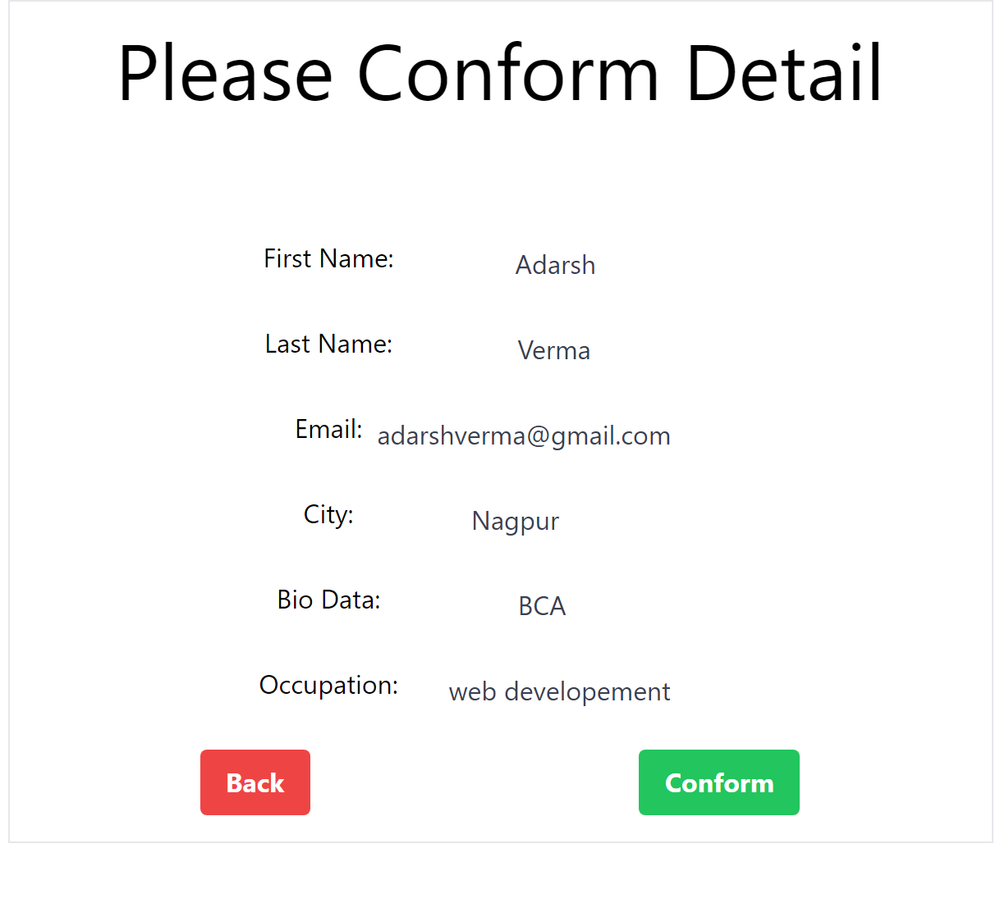
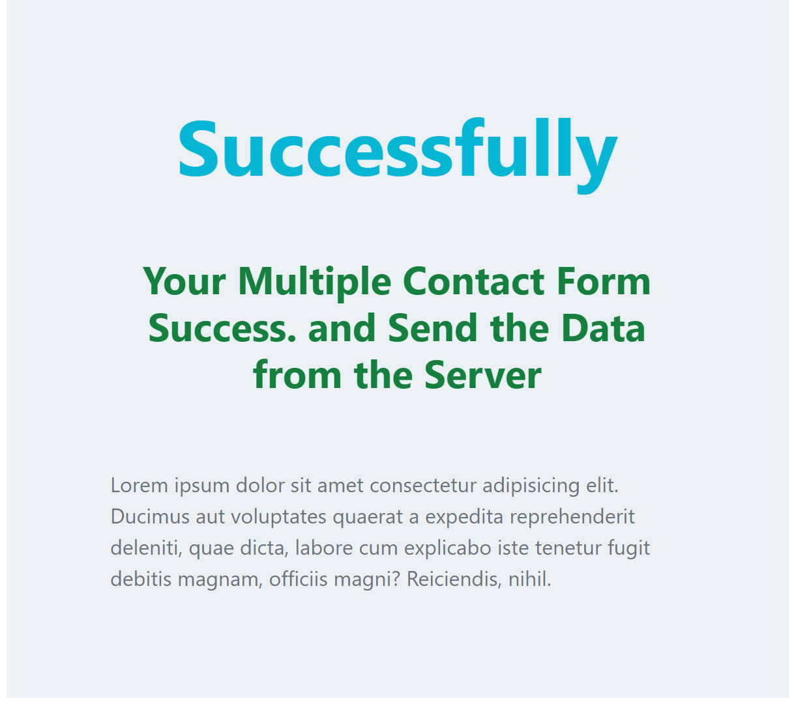

# Multi-Step Form with React

This is a class component that handles the state and rendering of a multi-step user form. Entering user details and continuing to the next step. Personal details with input fields for occupation, city, and bio data, along with buttons to go back or continue. Displays a form for users to confirm their personal details and allows them to go back or proceed to the next step. The Success function returns a React component that displays a success message with some text.

## Table of Contents

- [Features](#features)
- [Demo](#demo)
- [Installation](#installation)
- [Usage](#usage)
- [Contributing](#contributing)
- [License](#license)

## Features

- Multi-step form with a user-friendly interface.
- Form validation to ensure that required fields are filled out correctly.
- Ability to navigate back and forth between form steps.
- Real-time feedback on the completion status of each step.
- Customizable form fields to suit various data collection needs.
- Responsive design for optimal viewing on different devices.

## Demo

A live demo of the Multi-Step Form with React is available **[Live Demo](https://adarshtheki.github.io/multi-step-form-with-react/)**



## Installation

To run the Multi-Step Form with React locally, follow these steps:

1. Clone the repository:

   ```bash
   git clone https://github.com/AdarshTheki/multi-step-form-with-react.git
   ```

2. Navigate to the project directory:

   ```bash
   cd multi-step-form-with-react
   ```

3. Install the dependencies:

   ```bash
   npm install
   ```

## Usage

Once you have cloned the repository, navigated to the project directory, and installed the dependencies, you can start the development server with the following command:

```bash
npm start
```

The Multi-Step Form with React will be accessible at [http://localhost:3000](http://localhost:3000). You can interact with the form and test its functionality.

## Contributing

Contributions are welcome! If you find any issues with the project or have ideas for improvements, please open an issue or submit a pull request. Make sure to follow the project's code style and guidelines.

## License

The Multi-Step Form with React project is open-source and released under the [MIT License](LICENSE).
